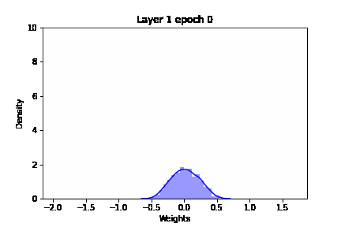
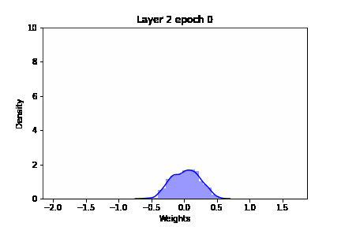
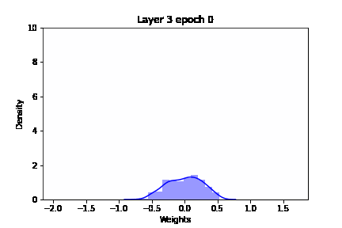

# prunpy

Neural network pruning 

Slowly completing parts of this project over lockdown. To run use: main.ipynb

## Fully connected

### Pruning algorithms

Magnitude percentage pruning: 

Prune largest n% of connections. There are 3 different possible functions of this schedule:

    static param: schedule_type: magnitude_percentage
    

1. one_shot. Prune threshold% of connections at each epoch. The mask will change at each epoch but will generally be the same

        static param: function: one_shot
    
        param: threshold: float: Percentage of connections to prune at each epoch  [0,1]
        param: epoch_threshold: int: Epoch to start beginning pruning.
    
    
2. one_shot_static. Prune threshold% of connections at each epoch. Creates a static mask after the first pruning epoch

        static param: function: one_shot
    
        param: threshold and epoch_threshold same as 1.

    
3. gradual. Prune threshold% of connections over a set range of epochs. Pruning will begin at epoch_threshold and continue to epoch_threshold + converge_over where a static mask is created. The sparsity threshold is linearly increased from epoch_threshold to epoch_threshold + converge_over.

        static param: function: gradual

        param: threshold and epoch_threshold same as 1.
        param: converge_over: Epochs to linearly increase the sparsity from 0 to threshold.

Magnitude threshold pruning:

Rewind pruning:

### Visualisation

Visualisation of magnitude percentage pruning with gradual pruning function.

 

    

## CNN

### Pruning algorithms

Coming soon.

### Visualisation

CNN visualiser to be completed.

# Senstivity analysis

